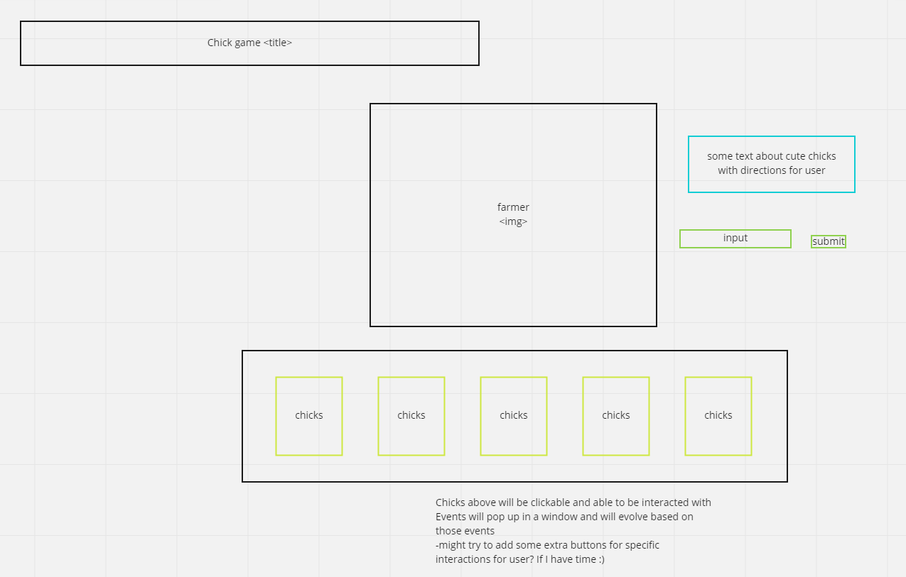

# HTML elements

## -I need an input for adding fresh new little chicks along with a button

## -Span tag for tracking the hatched chicks

## -Another span tag for tracking farmer HP

## -Chicks list

# State

## An array for the chicks (object with an id, name and hp)

## number of hatched chicks

## farmer hp

## currentID (in order to create new chicks with IDs)

# Events

## Each chick needs to be clickable and on click an event will pop up in a separate window and based on the events it will possibly increment or decrement chick or farmer's HP. It will also hatch chicks, update the DOM with new chick and farmer HP

## New chick form on submit

## -> user supplies the chick's name
